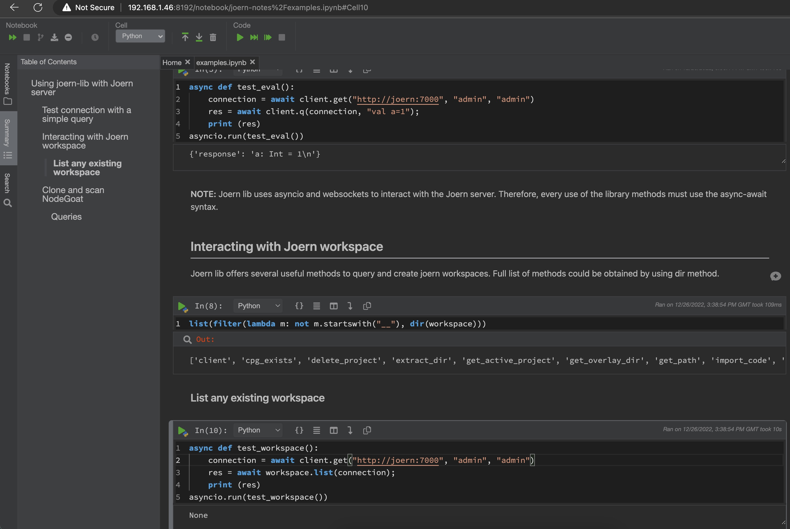

# Introduction

High level python library to interact with a Joern [server](https://docs.joern.io/server).

```
pip install joern-lib
```

The repository includes docker compose configuration to interactively query the joern server with polynote notebooks.




## Usage

Run joern server and polynote locally.

```
docker compose up -d
```

Navigate to http://localhost:8192 for an interactive polynote notebook to learn about joern server and this library.

### Common steps

```
python -m asyncio
```

Execute single query

```
from joern_lib import client, workspace
from joern_lib.detectors import common as cpg

connection = await client.get("http://localhost:7000", "admin", "admin")

# connection = await client.get("http://localhost:7000")

res = await client.q(connection, "val a=1");

# {'response': 'a: Int = 1\n'}
```

Execute bulk query

```
res = await client.bulk_query(connection, ["val a=1", "val b=2", "val c=a+b"]);
# [{'response': 'a: Int = 1\n'}, {'response': 'b: Int = 2\n'}, {'response': 'c: Int = 3\n'}]
```

### Workspace

List workspaces

```
res = await workspace.list(connection)
```

Get workspace path

```
res = await workspace.get_path(connection)
# /workspace (Response would be parsed)
```

Check if cpg exists

```
await workspace.cpg_exists(connection, "NodeGoat")
```

Import code for analysis

```
res = await workspace.import_code(connection, "/app", "NodeGoat")
# True
```

### CPG core

List files

```
res = await cpg.list_files(connection)
# list of files
```

### JavaScript specific

```
from joern_lib.detectors import js
```

List http routes

```
await js.list_http_routes(connection)
```

Name of the variable containing express()

```
await js.get_express_appvar(connection)
```

List of require statements

```
await js.list_requires(connection)
```

List of import statements

```
await js.list_imports(connection)
```

List of NoSQL DB collection names

```
await js.list_nosql_collections(connection)
```

Get HTTP sources

```
await js.get_http_sources(connection)
await js.get_http_sinks(connection)
```

### AWS

Requires TypeScript project

```
await js.list_aws_modules(connection)
```

## Troubleshooting

### No response from server

If Joern server stops responding after a while restart docker.

```
docker compose down
docker compose up -d
```
